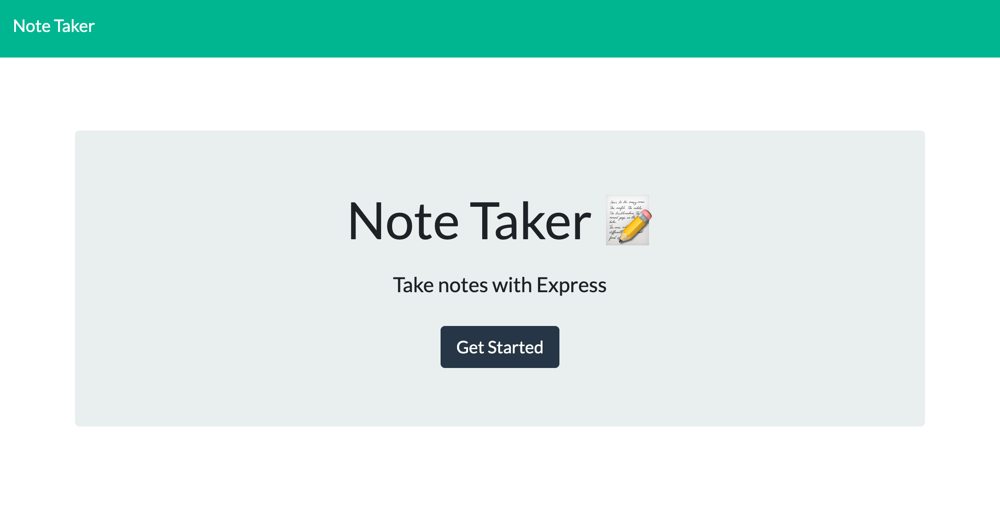

# Note Taker

## Description
An application called Note Taker that can be used to write and save notes. This application will use an Express.js back end and will save and retrieve note data from a JSON file.
## Table of Contents
* [Installation](#installation)
* [Usage](#usage)
* [Credits](#credits)
* [License](#license)
* [Tests](#tests)
* [Questions](#questions)
## Installation
For installation simply download/clone the repo. This application is an online web app you can access by clicking on the link provided in the "Usage" section.
## Usage
Click on the link below to access the web app.
* [Note Taker](https://noteswriter.herokuapp.com/)

## License
Licensed under MIT.
## Credits
None for now.
## Tests
None at the moment.
## Questions
Please feel free to contact me. GitHub & LinkedIn links provided below along with my Email.
* [GitHub](github.com/saul10huerta)
* [Email](saul10huerta@utexas.edu)
* [LinkedIn](https://www.linkedin.com/in/saul10huerta/)